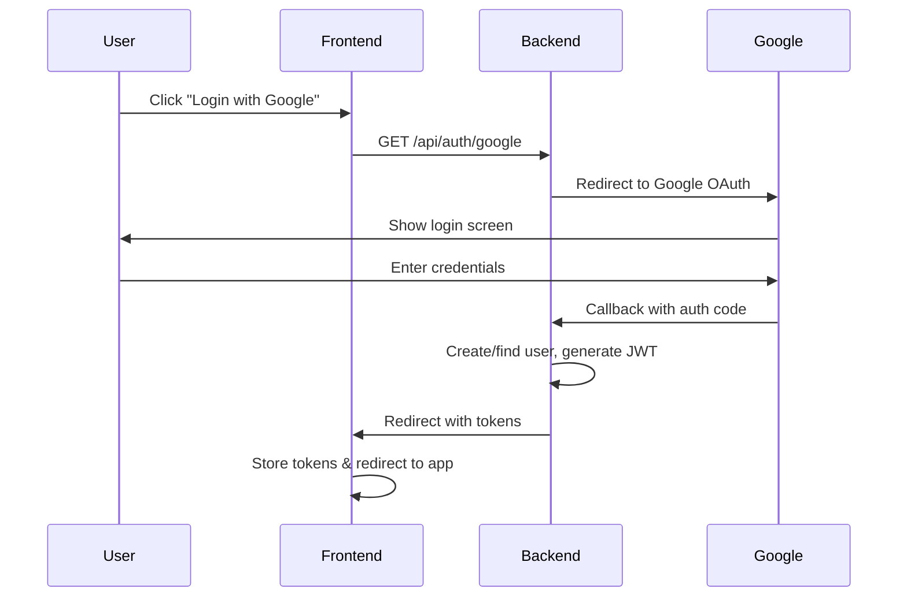

# Google OAuth Integration - Frontend Guide

## 📋 Tổng quan

Hướng dẫn tích hợp chức năng đăng nhập Google cho Frontend team. Backend đã cung cấp đầy đủ các API endpoints sử dụng Google OAuth 2.0 với Passport.js.

## 🔗 API Endpoints

### Base URL
```
Production: https://lct-locket-web-app.onrender.com
Development: http://localhost:3000
```

### 1. Khởi tạo Google OAuth Flow

**Endpoint:**
```
GET /api/auth/google
```

**Mô tả:** Redirect user đến trang đăng nhập Google

**Cách sử dụng:**
```javascript
// Button "Login with Google"
const handleGoogleLogin = () => {
  window.location.href = `${API_BASE_URL}/api/auth/google`;
};
```

### 2. OAuth Callback (Tự động xử lý bởi backend)

**Endpoint:**
```
GET /api/auth/google/callback
```

**Mô tả:** Google sẽ redirect về endpoint này sau khi user đăng nhập thành công. Backend sẽ xử lý và redirect về frontend.

### 3. OAuth Failure

**Endpoint:**
```
GET /api/auth/google/failure
```

**Response:**
```json
{
  "success": false,
  "message": "Google authentication failed",
  "error": "Authentication failed"
}
```

---

## 🔄 OAuth Flow



### Chi tiết từng bước:

1. **User clicks "Login with Google"**
   - Frontend redirect đến `/api/auth/google`

2. **Google Authentication**
   - User đăng nhập với tài khoản Google
   - Google yêu cầu cấp quyền (profile, email)

3. **Backend Processing**
   - Nhận thông tin user từ Google (email, name, avatar)
   - Kiểm tra user đã tồn tại chưa:
     - **Nếu có googleId:** Đăng nhập vào tài khoản
     - **Nếu có email:** Link tài khoản hiện tại với Google
     - **Nếu chưa có:** Tạo tài khoản mới
   - Generate JWT access token và refresh token
   - Set `emailVerified = true` tự động

4. **Frontend Callback**
   - Backend redirect về: `${FRONTEND_URL}/auth/google/success?accessToken=xxx&refreshToken=yyy`
   - Frontend lấy tokens từ URL params

5. **Complete Login**
   - Lưu tokens vào localStorage/cookies
   - Redirect user vào app

---

## 💻 Frontend Implementation

### 1. Setup Environment Variables

```env
VITE_API_URL=https://lct-locket-web-app.onrender.com
VITE_APP_URL=https://your-frontend-domain.com
```

### 2. Login Button Component

```jsx
// GoogleLoginButton.jsx
import React from 'react';

const GoogleLoginButton = () => {
  const handleGoogleLogin = () => {
    // Redirect to backend OAuth endpoint
    window.location.href = `${import.meta.env.VITE_API_URL}/api/auth/google`;
  };

  return (
    <button
      onClick={handleGoogleLogin}
      className="google-login-btn"
    >
      
      Continue with Google
    </button>
  );
};

export default GoogleLoginButton;
```

### 3. OAuth Callback Handler

Tạo route `/auth/google/success` để xử lý callback:

```jsx
// pages/AuthCallback.jsx
import { useEffect } from 'react';
import { useNavigate, useSearchParams } from 'react-router-dom';

const GoogleAuthCallback = () => {
  const [searchParams] = useSearchParams();
  const navigate = useNavigate();

  useEffect(() => {
    const accessToken = searchParams.get('accessToken');
    const refreshToken = searchParams.get('refreshToken');

    if (accessToken && refreshToken) {
      // Lưu tokens
      localStorage.setItem('accessToken', accessToken);
      localStorage.setItem('refreshToken', refreshToken);

      // Lấy thông tin user
      fetchUserProfile(accessToken);

      // Redirect về dashboard
      navigate('/dashboard');
    } else {
      // Xử lý lỗi
      console.error('No tokens received');
      navigate('/login', {
        state: { error: 'Google login failed' }
      });
    }
  }, [searchParams, navigate]);

  return (
    <div className="loading-screen">
      <p>Logging you in...</p>
    </div>
  );
};

const fetchUserProfile = async (accessToken) => {
  try {
    const response = await fetch(`${import.meta.env.VITE_API_URL}/api/auth/me`, {
      headers: {
        'Authorization': `Bearer ${accessToken}`,
      },
    });

    const data = await response.json();

    if (data.success) {
      // Lưu user info vào state management (Redux, Zustand, etc.)
      console.log('User profile:', data.data);
    }
  } catch (error) {
    console.error('Failed to fetch user profile:', error);
  }
};

export default GoogleAuthCallback;
```

### 4. Router Setup

```jsx
// App.jsx or routes.jsx
import { BrowserRouter, Routes, Route } from 'react-router-dom';
import GoogleAuthCallback from './pages/AuthCallback';

function App() {
  return (
    <BrowserRouter>
      <Routes>
        <Route path="/login" element={<LoginPage />} />
        <Route path="/auth/google/success" element={<GoogleAuthCallback />} />
        <Route path="/dashboard" element={<Dashboard />} />
      </Routes>
    </BrowserRouter>
  );
}
```

---

## 📦 Response Format

### Success Response

Sau khi đăng nhập thành công, backend redirect về:

```
https://your-frontend-domain.com/auth/google/success?accessToken=xxx&refreshToken=yyy
```

**URL Parameters:**
- `accessToken` (string): JWT access token (expires in 7 days)
- `refreshToken` (string): JWT refresh token (expires in 30 days)

### Get User Profile

Sau khi có access token, gọi API để lấy thông tin user:

**Request:**
```http
GET /api/auth/me
Authorization: Bearer {accessToken}
```

**Response:**
```json
{
  "success": true,
  "message": "User retrieved successfully",
  "data": {
    "id": "uuid",
    "email": "user@gmail.com",
    "name": "John Doe",
    "avatar": "https://lh3.googleusercontent.com/...",
    "role": "USER",
    "status": "ACTIVE",
    "emailVerified": true,
    "provider": "GOOGLE",
    "googleId": "1234567890",
    "createdAt": "2024-01-01T00:00:00.000Z",
    "updatedAt": "2024-01-01T00:00:00.000Z"
  }
}
```

### Error Response

**Redirect URL:**
```
https://your-frontend-domain.com/login?error=auth_failed
```

Hoặc backend có thể redirect về:
```
GET /api/auth/google/failure
```

**Response:**
```json
{
  "success": false,
  "message": "Google authentication failed",
  "error": "Authentication failed",
  "statusCode": 401
}
```

---

## 🔐 Security Best Practices

### 1. Token Storage

**Recommended:** HttpOnly Cookies (cần backend support)
```javascript
// Backend sẽ set cookie thay vì query params
res.cookie('accessToken', token, {
  httpOnly: true,
  secure: true,
  sameSite: 'strict'
});
```

**Alternative:** localStorage (hiện tại)
```javascript
localStorage.setItem('accessToken', accessToken);
localStorage.setItem('refreshToken', refreshToken);
```

### 2. CSRF Protection

```javascript
// Thêm CSRF token vào mỗi request
const csrfToken = getCsrfToken();

fetch('/api/protected', {
  headers: {
    'X-CSRF-Token': csrfToken,
    'Authorization': `Bearer ${accessToken}`
  }
});
```

### 3. Token Refresh

```javascript
// Tự động refresh token khi sắp hết hạn
const refreshAccessToken = async () => {
  const refreshToken = localStorage.getItem('refreshToken');

  try {
    const response = await fetch(`${API_URL}/api/auth/refresh-token`, {
      method: 'POST',
      headers: {
        'Content-Type': 'application/json',
      },
      body: JSON.stringify({ refreshToken }),
    });

    const data = await response.json();

    if (data.success) {
      localStorage.setItem('accessToken', data.data.accessToken);
      localStorage.setItem('refreshToken', data.data.refreshToken);
      return data.data.accessToken;
    }
  } catch (error) {
    // Refresh failed, logout user
    handleLogout();
  }
};
```

---

## 🧪 Testing

### Local Development

1. **Backend:** `http://localhost:3000`
2. **Frontend:** `http://localhost:5173` (Vite default)

**Cấu hình Google Console:**
- Authorized redirect URIs: `http://localhost:3000/api/auth/google/callback`

### Production

**Cấu hình Google Console:**
- Authorized redirect URIs: `https://lct-locket-web-app.onrender.com/api/auth/google/callback`

---

## 🎨 UI/UX Recommendations

### 1. Loading State

```jsx
const [isLoading, setIsLoading] = useState(false);

const handleGoogleLogin = () => {
  setIsLoading(true);
  window.location.href = `${API_URL}/api/auth/google`;
};

return (
  <button onClick={handleGoogleLogin} disabled={isLoading}>
    {isLoading ? 'Redirecting...' : 'Continue with Google'}
  </button>
);
```

### 2. Error Handling

```jsx
const GoogleAuthCallback = () => {
  const [error, setError] = useState(null);

  useEffect(() => {
    const accessToken = searchParams.get('accessToken');
    const errorParam = searchParams.get('error');

    if (errorParam) {
      setError('Google authentication failed. Please try again.');
      setTimeout(() => navigate('/login'), 2000);
      return;
    }

    if (!accessToken) {
      setError('No access token received.');
      return;
    }

    // Process login...
  }, []);

  if (error) {
    return <ErrorMessage>{error}</ErrorMessage>;
  }

  return <LoadingSpinner />;
};
```

### 3. Google Button Design

Follow [Google's Brand Guidelines](https://developers.google.com/identity/branding-guidelines):

```css
.google-login-btn {
  display: flex;
  align-items: center;
  gap: 12px;
  padding: 12px 24px;
  background: #fff;
  border: 1px solid #dadce0;
  border-radius: 4px;
  font-family: 'Roboto', sans-serif;
  font-size: 14px;
  font-weight: 500;
  color: #3c4043;
  cursor: pointer;
  transition: all 0.2s;
}

.google-login-btn:hover {
  background: #f8f9fa;
  border-color: #d2d3d4;
}
```

---

## 🐛 Common Issues & Solutions

### Issue 1: "Redirect URI mismatch"

**Cause:** Google Console URI không khớp với backend callback URL

**Solution:**
- Check Google Console > Credentials > OAuth 2.0 Client IDs
- Add exact URI: `https://lct-locket-web-app.onrender.com/api/auth/google/callback`

### Issue 2: CORS Error

**Cause:** Frontend domain không được phép gọi backend API

**Solution:**
- Backend đã cấu hình CORS trong `app.js`
- Đảm bảo frontend domain được thêm vào whitelist

### Issue 3: Tokens không được trả về

**Cause:** Frontend callback URL không đúng

**Solution:**
- Check biến môi trường `FRONTEND_URL` ở backend
- Đảm bảo route `/auth/google/success` tồn tại ở frontend

### Issue 4: "User already exists with different provider"

**Scenario:** User đã đăng ký bằng email/password, sau đó login bằng Google với cùng email

**Behavior:** Backend tự động link tài khoản
- Update `provider = GOOGLE`
- Add `googleId`
- Keep existing password
- Set `emailVerified = true`

---

## 📞 Support & Contact

- **Backend API:** https://lct-locket-web-app.onrender.com
- **Documentation:** `/docs` hoặc `/api-docs`
- **Issues:** Liên hệ Backend team

---

## 📝 Changelog

### v1.0.0 (2024-11-06)
- ✅ Initial Google OAuth implementation
- ✅ Account linking support
- ✅ JWT token generation
- ✅ Email auto-verification for Google users
- ✅ Frontend callback with URL params
